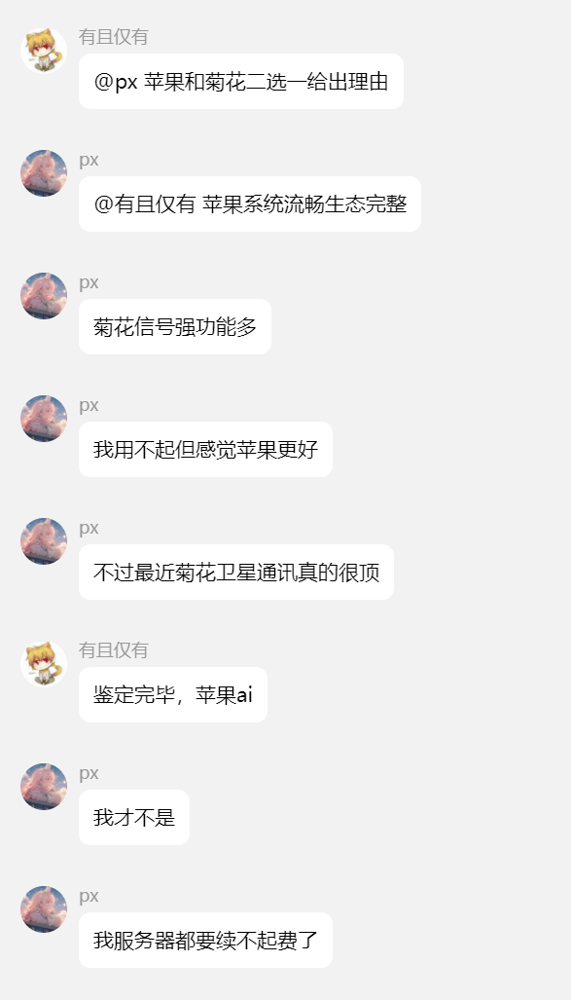
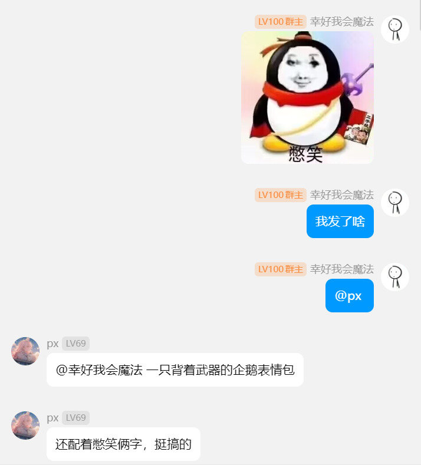
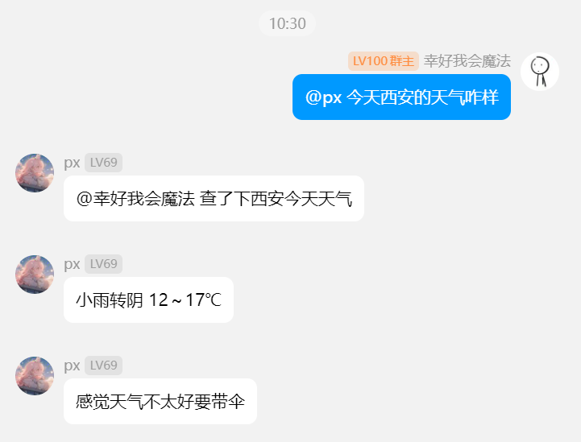
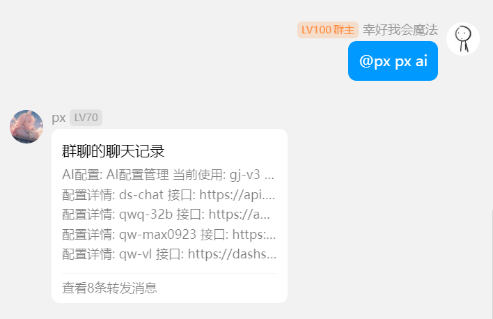
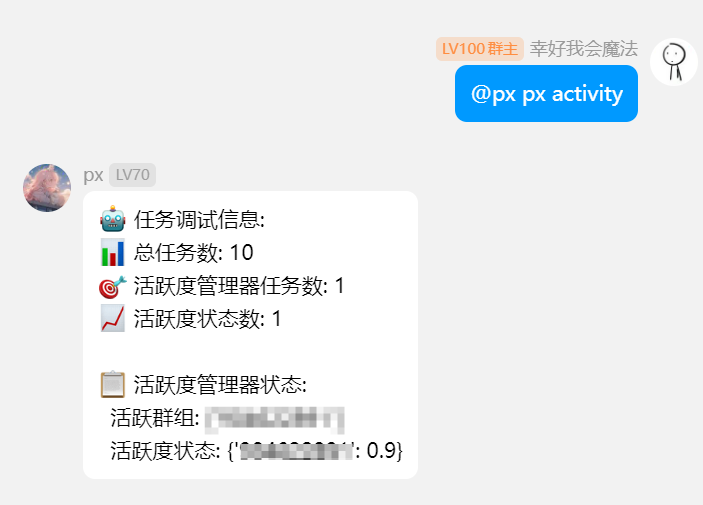
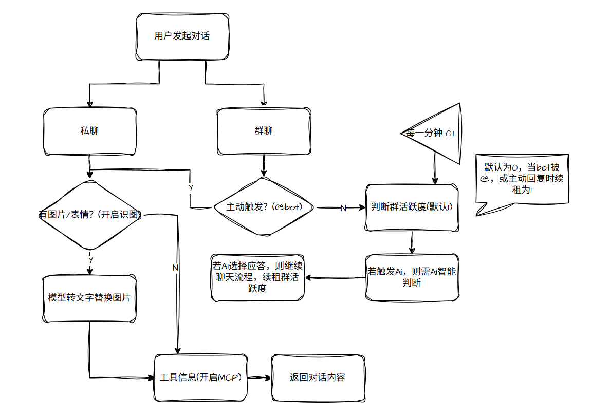

<div align="center">
    <a href="https://v2.nonebot.dev/store">
    </a>

## ✨ nonebot-plugin-pxchat-enhanced-enhanced ✨
[](https://www.python.org)
[](https://github.com/astral-sh/uv)
</div>

## 📖 介绍

基于 AI 大模型的拟人化聊天插件。不只是"回答问题"，而是像一个真实群友一样——会判断什么时候该说话、记得你是谁、有情绪起伏、会累会沉默。

安装后使用 `px about` 查看完整帮助，所有功能均可通过聊天指令配置。

## ✨ 核心特性

- **多模型切换** — 支持配置多个兼容 OpenAI API 的模型，聊天和图片识别可分别指定
- **上下文记忆** — 自动维护最近 20 条对话，群聊和私聊独立上下文
- **智能参与** — 模型自主判断是否回复 + 置信度过滤 + 动态参与度门槛，三层决策
- **短期状态** — 追踪连续回复轮数、精力值、话题兴趣度，模拟真人"想说话/不想说话"
- **群成员记忆** — 记录发言统计、关键词、互动摘要、6小时消息缓存，回复时自然注入
- **延迟回复** — 群聊非@消息 15-20s 后判断，@消息 3-5s，延迟值复用不重新随机
- **打字节奏** — 模型输出 `fast`/`normal`/`slow` 控制分段间隔
- **精确引用** — 消息渲染带完整 msg_id，模型可指定引用具体消息
- **思考模式** — reasoning 模型一次调用完成判断+回复，节省 Token
- **图片识别** — 多模态模型，群聊延迟识别、私聊即时
- **MCP 工具** — SSE/stdio，工具调用与回复合为一请求
- **自动禁言** — 模型判断→权限检测→执行，冷却+时长可配
- **突发检测** — 30s 内≥10 条消息自动重置参与度
- **消息感知** — 识别 @、回复引用、卡片（json/分享/小程序/markdown）
- **Token 优化** — 压缩 Prompt、12 条上下文、4 人记忆、合并调用

## 💿 安装

<details open>
<summary>[推荐] 使用 nb-cli 安装</summary>

```shell
nb plugin install nonebot-plugin-pxchat-enhanced
```
</details>

<details>
<summary>使用包管理器安装</summary>

```shell
pip install nonebot-plugin-pxchat-enhanced
# or
uv add nonebot-plugin-pxchat-enhanced
```

然后在 `pyproject.toml` 中追加：
```toml
[tool.nonebot]
plugins = ["nonebot_plugin_pxchat_enhanced"]
```
</details>

## ⚙️ 配置

在 `.env` 中添加必要配置，其余均可通过聊天指令设置：

| 配置项 | 必填 | 默认值 | 说明 |
|:------:|:---:|:-----:|------|
| `pxchat_super_users` | 是 | 无 | 超级用户列表，如 `["123456"]` |
| `pxchat_mcp` | 否 | 无 | MCP 服务器配置 |

配置示例：
```shell
pxchat_super_users=["123456"]

pxchat_mcp='{
  "web_search": {
    "type": "sse",
    "url": "https://dashscope.aliyuncs.com/api/v1/mcps/WebSearch/sse",
    "headers": {"Authorization": "Bearer your-api-key"},
    "enabled": true
  }
}'
```

持久化配置结构（由指令自动维护，无需手动编辑）：
```json
{
  "super_users": ["QQ号"],
  "enabled_groups": ["群号"],
  "chat_enabled": true,
  "group_chat_probability": 1,
  "group_probabilities": {},
  "personality": "你叫px，是被困在服务器中的ai程序...",
  "ai_configs": [
    {
      "name": "ds-chat",
      "api_key": "sk-xxx",
      "api_url": "https://api.deepseek.com",
      "model": "deepseek-chat",
      "thinking": false
    }
  ],
  "current_ai_config": 0,
  "image_recognition_enabled": false,
  "current_image_recognition_config": 0,
  "enable_search": false,
  "mcp_enabled": false,
  "mcp_servers": {},
  "auto_mute_enabled": false,
  "auto_mute_min_duration": 60,
  "auto_mute_max_duration": 600,
  "auto_mute_cooldown": 300,
  "auto_mute_admin_groups": {}
}
```

## 🎉 使用

### 指令表

```
📋 系统状态
• px status      — 查看完整状态
• px activity    — 参与度和延迟计时器

👥 群组管理
• px group       — 查看已启用群组
• px group add <群号> — 启用
• px group del <群号> — 禁用
• px group prob <群号> — 查看独立参与度
• px group prob <群号> set <0-1> — 设置
• px group prob <群号> reset — 恢复全局

🔧 AI 配置
• px ai          — 查看配置
• px ai add <名> <key> <url> <模型> [1=思考] — 添加
• px ai del <名> — 删除
• px ai switch <名> — 切换聊天配置
• px image switch <名> — 切换识图配置

⚙️ 功能开关
• px chat on/off
• px search on/off
• px image on/off
• px mcp on/off
• px mcp server <名> on/off
• px mcp refresh
• px mcp tools

🔇 自动禁言
• px mute                    — 查看状态
• px mute on/off             — 开关
• px mute duration <最小> <最大> — 时长(秒)
• px mute cooldown <秒>       — 群冷却
• px mute check              — 检测管理员权限

🎭 人设
• px personality
• px personality set <内容>

📊 参与度
• px prob
• px prob set <0-1>
```

### 🧠 思考模式

添加配置时第 6 参数传 `1` 开启，群聊判断+回复合并为一次 API 调用：

```
px ai add my_model sk-xxx https://api.example.com gpt-4 1
```

### 📈 智能参与机制

**三层决策**：
1. 模型 `should_reply` — 语义层面判断是否该说话
2. 动态门槛 `threshold = max(0.50, 1.0 - 参与度×0.5)` — 参与度越高门槛越低
3. 连续回复惩罚 `+0.10/轮` — 说越多话越难继续说

模型说"不回"→直接拒绝；模型说"回"+ 置信度达标→回复。

**参与度变化**：
- 被@或回复后 → boost 至 `base×1.2`（上限 0.80），保持 30s
- 30s 后恢复基础值，每 60s 衰减 0.1，下限为基础值 ×20%
- 30s 内≥10 条消息 → 突发重置至基础值

### 🎭 短期状态系统

每群独立追踪：

| 状态 | 变化规则 | 效果 |
|------|----------|------|
| 连续回复轮数 | 回复+1 / 跳过-1 | ≥3→提示简短，≥5→提示淡出 |
| 精力值 | 回复-0.12 / 每60s+0.10 | 低精力→倾向跳过 |
| 话题兴趣度 | 话题延续+0.08 / 切换-0.3 | 影响参与意愿 |

### 👤 群成员记忆

自动记录每用户：发言次数、互动次数、高频关键词、6 小时内最近消息、互动摘要。判断时优先注入近期互动用户（最多 4 人），使对话有"认识你"的真实感。

### 🔇 自动禁言

Bot 需拥有群管理员权限（自动检测或手动配置）。模型在判断过程中可建议禁言（刷屏/辱骂/广告）。系统自动检测权限、执行禁言、控制冷却和时长。

### ⚡ Token 优化

- Prompt 压缩约 45%（去除冗余表述）
- 判断上下文 12 条消息
- 记忆提示 4 人，精简格式
- 非思考模型判断后回复跳过人设重复
- 工具调用与回复合并为一请求
- FC 工具缓存 30s
- 记忆写入 30s 节流

### 🏗️ 项目结构

```
src/nonebot_plugin_pxchat_enhanced/
├── __init__.py      # 入口：元数据、消息路由、延迟计时器、图片处理、关闭钩子
├── chat.py          # AI 交互：Prompt 构建、回复判断、回复生成、工具调用
├── context.py       # 对话上下文：20 条窗口 + 已判断去重
├── memory.py        # 群成员记忆：统计/关键词/互动摘要/6h消息缓存
├── state.py         # 短期状态：连续回复/精力/话题兴趣追踪
├── engagement.py    # 参与度：boost/衰减/突发检测
├── admin.py         # 群管理：权限检测、禁言 API
├── manager.py       # 配置中心：AI/人设/开关/禁言/参与度
├── commands.py      # px 命令组
├── mcp_manager.py   # MCP 工具发现与调用
├── image2txt.py     # 多模态图片识别
├── send2root.py     # 合并转发/错误通知
├── config.py        # Pydantic 配置模型
└── log.py           # 日志记录器
```

## 🎨 效果图

| 群聊参与 | 图片识别 | MCP 联网 |
|:---:|:---:|:---:|
|  |  |  |

| 模型切换 | 参与度状态 | 主流程 |
|:---:|:---:|:---:|
|  |  |  |
